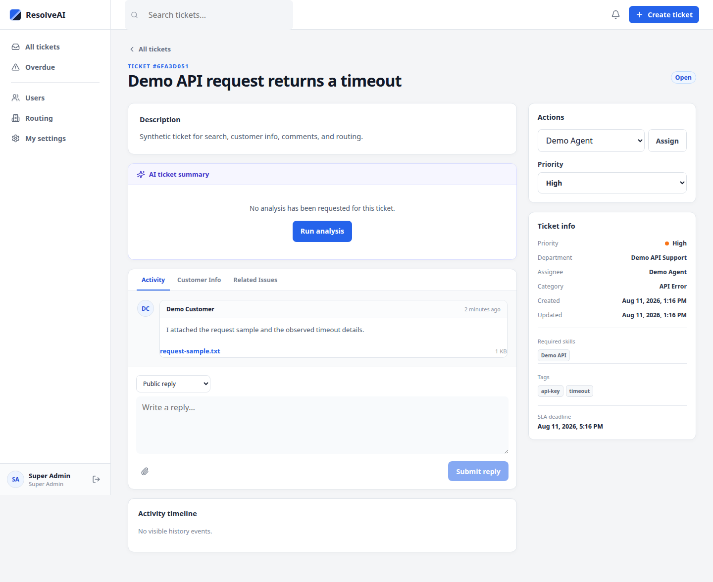

# AI customer support ticket system

This project is a customer-support backend with a React staff workspace. It
manages users, tickets, comments, permissions, agent routing, SLA deadlines,
background jobs, and optional AI-assisted ticket analysis.

The API uses FastAPI. The staff workspace in `site/` uses React, TypeScript,
and Vite. The Docker stack runs PostgreSQL, Redis, RQ workers, the API, and the
frontend together.



The screenshot uses synthetic local demo data. Acceptance evidence is recorded
in [docs/ACCEPTANCE.md](docs/ACCEPTANCE.md).

## What it includes

- Users, roles, agent profiles, and availability
- JWT login, refresh-token sessions, and logout
- Ticket search, filters, pagination, assignment, claiming, and start-work
- Comments, related issues, attachments, and recipient-only notifications
- Department and skill-based routing with SLA deadlines
- Redis caching and login rate limiting
- RQ jobs for routing, AI analysis, and scheduled checks
- Fake analysis for offline runs and OpenRouter analysis when configured

## Technology

- Python, FastAPI, Pydantic, SQLAlchemy, and Alembic
- PostgreSQL for Docker runs and SQLite for local tests
- Redis and RQ for caching, rate limiting, workers, and scheduled jobs
- JWT with RS256 signing, refresh-token sessions, and bcrypt password hashing
- React, TypeScript, Vite, and Vitest for the staff workspace
- Docker Compose for the full local stack

## Start the full stack with Docker

Requirements: Docker, the Docker Compose plugin, and OpenSSL.

Create the local environment file:

```bash
cp .env.example .env
```

Set `POSTGRES_PASSWORD`, `SUPERADMIN_PASSWORD`, and a private
`REFRESH_TOKEN_SECRET` in `.env`. Generate the secret with:

```bash
openssl rand -hex 32
```

The API also needs an RSA key pair. Create it in the ignored `keys/` directory:

```bash
mkdir -p keys
openssl genpkey -algorithm RSA -pkeyopt rsa_keygen_bits:2048 -out keys/private.pem
openssl rsa -in keys/private.pem -pubout -out keys/public.pem
```

Start the stack:

```bash
./project.sh
```

The launcher builds the images, runs migrations, waits for health checks, and
creates the configured superadmin when the database has no users. It does not
reset existing PostgreSQL data.

Open the staff workspace at `http://localhost:5173`. Open the API docs at
`http://localhost:8000/docs` and the health endpoint at
`http://localhost:8000/health`.

```bash
./project.sh status
./project.sh logs
./project.sh stop
```

## Run the services without Docker

This path requires Redis, the API, an RQ worker, RQ cron, and the Vite frontend.

```bash
# Use SQLite and ANALYZER_PROVIDER=fake for an offline local run.

redis-server                                            # 1
myvenv/bin/python -m uvicorn main:app --reload          # 2
myvenv/bin/rq worker ticket_routing ticket_jobs \
  --url redis://localhost:6379/0                        # 3 (routing first = priority)
myvenv/bin/rq cron src/jobs/cron.py \
  --url redis://localhost:6379/0                        # 4

cd site
npm install
npm run dev
```

Open `http://127.0.0.1:5173`. Set the `SUPERADMIN_*` variables before running
`myvenv/bin/python bootstrap_superadmin.py`.

## Run the checks

```bash
myvenv/bin/python -m pytest -q
cd site
npm test
npm run build
```

## API areas

- **Users:** register, list, get, update, agent availability and profiles, and soft delete
- **Auth:** `POST /auth/login`, `/auth/refresh`, and `/auth/logout` with Bearer JWT
- **Tickets:** SQL-backed search, filters, pagination, My Queue, claim, assign,
  start-work, comments, ticket-scoped customer info, related issues, and
  durable AI analysis results
- **Staff workspace:** role-aware Users, Routing catalogs, My Settings, agent
  availability, secure comment attachments, and recipient-only notifications
- **Jobs:** background job status and listing

API errors use the envelope `{ "error": { "code", "message" } }`.

## Detailed documentation

- [Architecture](docs/ARCHITECTURE.md)
- [Permissions](docs/PERMISSIONS.md)
- [Ticket workflow](docs/TICKET_WORKFLOW.md)
- [API examples](docs/API_EXAMPLES.md)
- [Reliability and security](docs/RELIABILITY.md)
- [Attachment contract](docs/ATTACHMENTS.md)
- [Stage 10 acceptance evidence](docs/ACCEPTANCE.md)

## Repository structure

```text
main.py                 FastAPI app entrypoint
Dockerfile / compose.yaml   Full-stack deployment
alembic/                PostgreSQL schema migrations
src/routers/            API route handlers
src/services/           Business logic and permissions
src/db/                 SQLAlchemy engine, models, operations
src/models/             Pydantic request/response models
src/core/               Security, config, logging
src/jobs/               RQ queues, worker tasks, cron
src/analyzers/          Fake and OpenRouter analyzers
src/cache/              Redis helpers
src/tests/              Pytest suite
site/                   Vite/React frontend (see site/README.md)
```

## How requests move through the system

Synchronous requests follow `router -> auth dependency -> service -> database`.
Routing and analysis cross a process boundary through Redis and RQ.

- **Routing:** a classified ticket with `department_id` set is enqueued on
  `ticket_routing`; a worker assigns it to the eligible least-loaded agent in
  one idempotent database transaction. RQ cron re-enqueues tickets whose
  enqueue failed earlier.
- **Analysis:** the API creates a durable `PENDING` row. A `ticket_jobs` worker
  processes it with the fake analyzer or OpenRouter and stores `COMPLETED` or
  `FAILED`. SQL remains the source of truth.

Redis also provides ticket-detail caching (SQL fallback on failure) and login
rate limiting (fails closed). SLA deadlines combine status base hours with a
priority multiplier; a periodic scanner records one overdue event per ticket.
